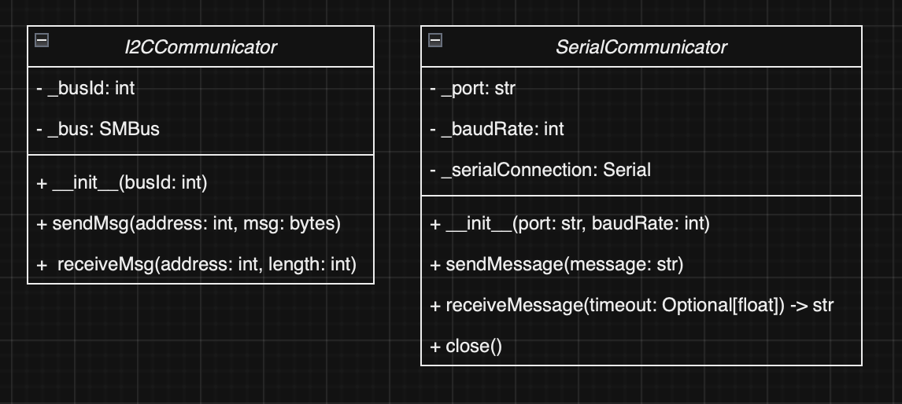

# Communicator Common

Common package for communications between devices. Contains Communicator classes which can be used to build controllers to handle communications between different devices in a simple and abstracted way.

## Table of Contents

-   [Installation](#installation)
-   [Usage](#usage)
-   [Contributing](#contributing)
-   [License](#license)

## Installation

To install this package, use the commands `pip install git+https://github.com/ECU-ATMAE-ROBOTICS/CommunicatorCommon`
This package relies on SMBus2 and pySerial, both of which install upon installing the CommunicatorCommon Package.

## Usage

### I2C Communicator

-   Sending Data Through I2C

```python
communicator = I2CCommunicator(busId=1)
device_address = 8
message = b'Test message to send via I2C.'

try:
    communicator.sendMsg(device_address, message)
    print("Message sent successfully via I2C.")
except Exception as e:
    print(f"Failed to send message via I2C. Error: {e}")

communicator.close()
```

-   Receiving Data Through I2C

```python
communicator = I2CCommunicator(busId=1)
device_address = 8
data_length = 10

try:
    received_data = communicator.receiveMsg(device_address, data_length)
    print(f"Received data via I2C: {received_data}")
except Exception as e:
    print(f"Failed to receive data via I2C. Error: {e}")

communicator.close()
```

### Serial Communicator

-   Sending Data Through Serial

```python

communicator = SerialCommunicator(port="/dev/ttyACM0", baudRate=9600)
message = "Test message to send via the serial port."

try:
    communicator.sendMessage(message)
    print("Message sent successfully through the serial port.")
except Exception as e:
    print(f"Failed to send message through the serial port. Error: {e}")

communicator.close()

```

-   Receiving Data Through Serial

```python
communicator = SerialCommunicator(port="/dev/ttyACM0", baudRate=9600)

try:
    received_message = communicator.receiveMessage()
    print(f"Received message from the serial port: {received_message}")
except Exception as e:
    print(f"Failed to receive message from the serial port. Error: {e}")

communicator.close()
```

## Contributing

Please ensure your pull request adheres to the following guidelines:

-   Keep descriptions short and simple, but descriptive.
-   Check your spelling and grammar.
-   Make sure your code follows the style guide of this project.
-   Ensure your code does not generate any new warnings or errors.

If you find a bug, kindly open an issue.

Any contributions you make will be under the GPL-3 License. In submitting a pull request, you agree to license your work under the same license.

For major changes, please open an issue first to discuss what you would like to change.

## License

This project is licensed under the GPL-3 License - see the [LICENSE](LICENSE) file for details.

## Docs


